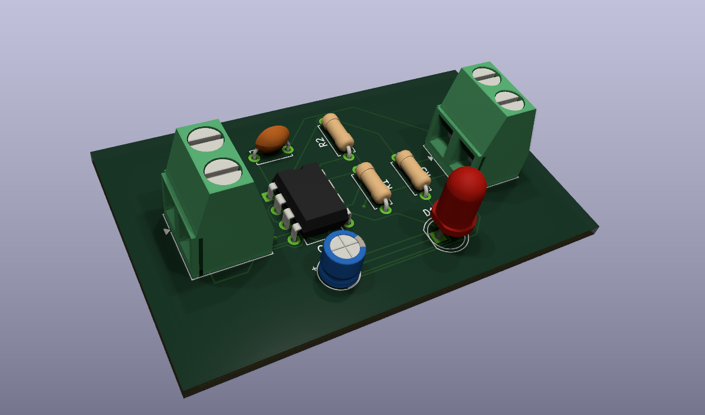

# Astable Multivibrator (NE555 Timer)

A through-hole KiCad project implementing an astable multivibrator using a NE555 timer in DIP-8 format. The board generates a blinking output signal and includes an LED indicator plus external terminal connections for power and signal output.

## Overview

- **Circuit type:** Astable multivibrator
- **IC:** NE555P (DIP-8)
- **Supply:** DC power input via 2-pin terminal block (J1)
- **Output:** 2-pin terminal block (J2) provides the NE555 output and ground reference
- **Board type:** 2-layer PCB, 1.6 mm thickness, through-hole components

## Key Components

- `U1` — NE555P timer, `Package_DIP:DIP-8_W7.62mm`
- `R1` — 2 kΩ resistor, `Resistor_THT:R_Axial_DIN0207_L6.3mm_D2.5mm_P7.62mm_Horizontal`
- `R2` — 146 kΩ resistor, `Resistor_THT:R_Axial_DIN0207_L6.3mm_D2.5mm_P7.62mm_Horizontal`
- `R3` — 560 Ω resistor, `Resistor_THT:R_Axial_DIN0207_L6.3mm_D2.5mm_P7.62mm_Horizontal`
- `C1` — 10 µF electrolytic capacitor, `Capacitor_THT:CP_Radial_D5.0mm_P2.00mm`
- `C2` — 0.1 µF bypass capacitor, `Capacitor_THT:C_Disc_D5.0mm_W2.5mm_P5.00mm`
- `D1` — LED indicator, `LED_THT:LED_D5.0mm`
- `J1` — 2-pin Phoenix terminal block for power input, `TerminalBlock_Phoenix:TerminalBlock_Phoenix_MKDS-1,5-2-5.08mm_Horizontal`
- `J2` — 2-pin Phoenix terminal block for output and ground, same footprint as `J1`

## Connector Pinout

- `J1` — Power input
  - Pin 1: `GND`
  - Pin 2: `VCC`
- `J2` — Output terminal
  - Pin 1: `Output` (NE555 pin 3)
  - Pin 2: `GND`

## Project Files

- `Astable_Multivibrator.kicad_sch` — Schematic file
- `Astable_Multivibrator.kicad_pcb` — PCB layout file
- `Astable_Multivibrator.kicad_prl` — PCB print settings
- `Astable_Multivibrator.kicad_pro` — Project settings
- `DRC.rpt` — Design rule check report
- `report.txt` — Schematic validation / netlist report
- `Gerbers/` — Generated Gerber outputs for fabrication
- `Gerbers.zip` — Archive of the Gerber files

## Usage

1. Open `Astable_Multivibrator.pro` in KiCad (recommended KiCad 10 or later).
2. Review the schematic and PCB layout for your chosen component footprints.
3. Run ERC in Eeschema and DRC in Pcbnew before fabrication.
4. Export Gerbers from the `Gerbers/` folder or regenerate them as needed.

## Notes

- The board is designed for standard through-hole assembly.
- Component placement and routing are built for a simple low-frequency blinking oscillator.
- Verify supply voltage compatibility for the NE555 and LED before connecting power.
